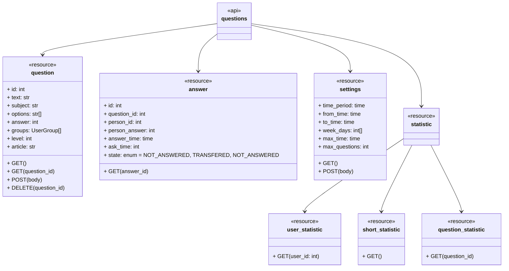
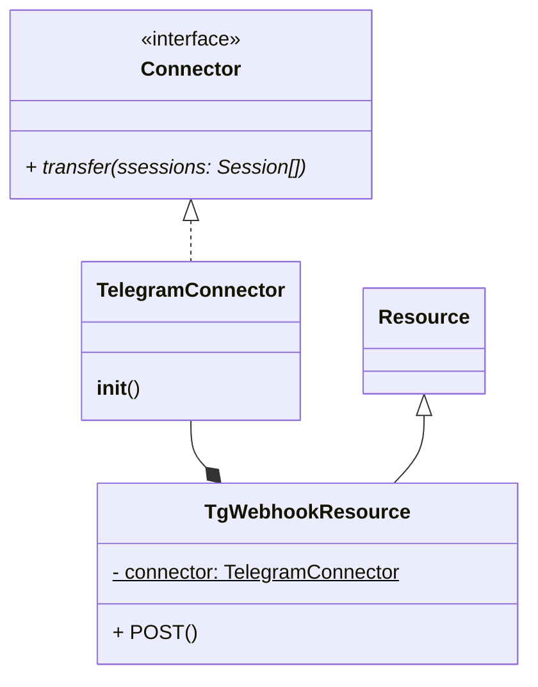
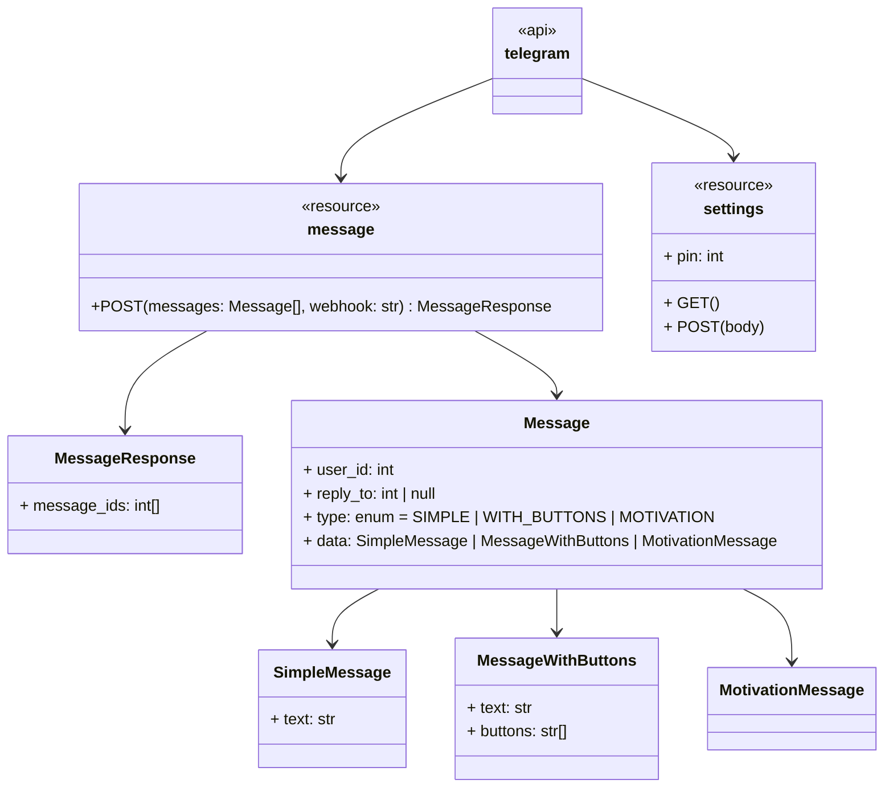
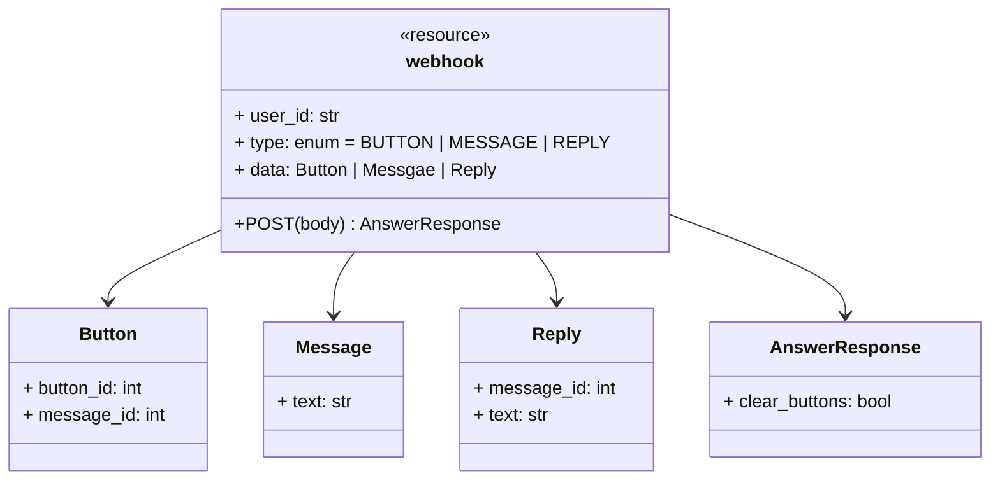
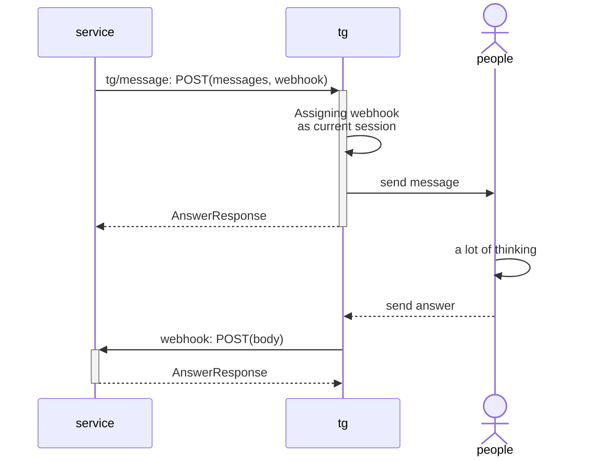

# Questions service

### API

```mermaid
classDiagram
    class questions
    class question {
        + id: int
        + text: str
        + subject: str
        + options: str[]
        + answer: int
        + groups: UserGroup[]
        + level: int
        + article: str
        + GET()
        + GET(question_id)
        + POST(body)
        + DELETE(question_id)
    }
    class answer {
        + id: int
        + question_id: int
        + person_id: int
        + person_answer: int
        + answer_time: time
        + ask_time: int
        + state: enum = NOT_ANSWERED, TRANSFERED, NOT_ANSWERED
        + GET(answer_id)
    }
    class settings {
        + time_period: time
        + from_time: time
        + to_time: time
        + week_days: int[]
        + max_time: time
        + max_questions: int
        + GET()
        + POST(body)
    }
    class statistic
    class user_statistic {
        + GET(user_id: int)
    }
    class short_statistic {
        + GET()
    }
    class question_statistic {
        + GET(question_id)
    }

    questions --> question
    questions --> answer
    questions --> settings
    questions --> statistic
    statistic --> user_statistic
    statistic --> short_statistic
    statistic --> question_statistic
    <<api>> questions
    <<resource>> question
    <<resource>> answer
    <<resource>> statistic
    <<resource>> user_statistic
    <<resource>> short_statistic
    <<resource>> question_statistic
    <<resource>> settings

```

### Connector

```mermaid
classDiagram
    class Connector {
        + transfer(ssessions: Session[])*
    }
    class TelegramConnector {
        __init__()
    }
    class Resource
    class TgWebhookResource {
        - connector: TelegramConnector$
        + POST()
    }

    Connector <|.. TelegramConnector
    TelegramConnector --* TgWebhookResource
    Resource <|-- TgWebhookResource
    <<interface>> Connector
```

# Telegram service

### Telegram service API

```mermaid
classDiagram
    class message {
        +POST(messages: Message[], webhook: str) MessageResponse
    }
    class MessageResponse {
        + message_ids: int[]
    }
    class Message {
        + user_id: int
        + reply_to: int | null
        + type: enum = SIMPLE | WITH_BUTTONS | MOTIVATION
        + data: SimpleMessage | MessageWithButtons | MotivationMessage
    }
    class SimpleMessage {
        + text: str
    }
    class MessageWithButtons {
        + text: str
        + buttons: str[]
    }
    class MotivationMessage {
    }
    class settings {
        + pin: int
        + GET()
        + POST(body)
    }

    telegram --> message
    message --> Message
    Message --> SimpleMessage
    Message --> MessageWithButtons
    Message --> MotivationMessage
    message --> MessageResponse
    telegram --> settings
    <<api>> telegram
    <<resource>> message
    <<resource>> settings
```

### Webhook resource

```mermaid
classDiagram
    class webhook {
        + user_id: str
        + type: enum = BUTTON | MESSAGE | REPLY
        + data: Button | Messgae | Reply
        +POST(body) AnswerResponse
    }
    class Message {
        + text: str
    }
    class Button {
        + button_id: int
        + message_id: int
    }
    class Reply {
        + message_id: int
        + text: str
    }
    class AnswerResponse {
        + clear_buttons: bool
    }

    webhook --> Button
    webhook --> Message
    webhook --> Reply
    webhook --> AnswerResponse
    <<resource>> webhook
```

### Sending messages

```mermaid

sequenceDiagram
    service ->>+ tg: tg/message: POST(messages, webhook)
    tg ->> tg: Assigning webhook <br> as current session
    actor people
    tg ->> people: send message
    tg -->>- service: AnswerResponse
    people ->> people: a lot of thinking
    people -->> tg: send answer
    tg ->>+ service: webhook: POST(body)
    service -->>- tg: AnswerResponse
```
